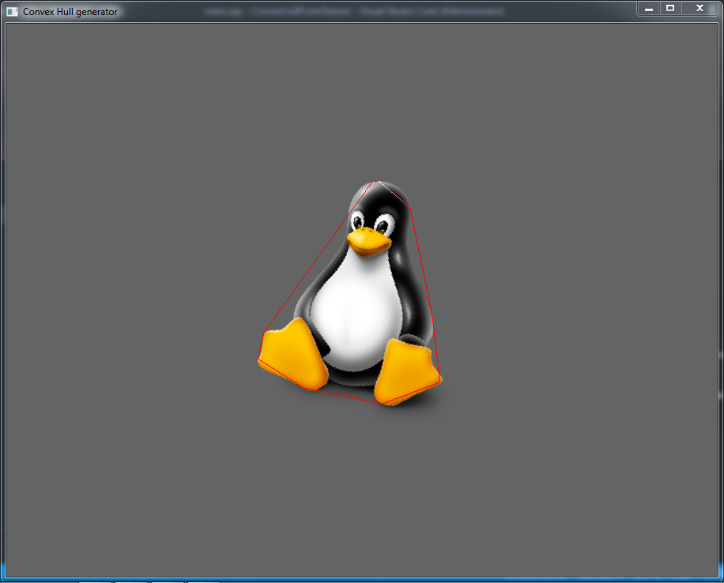
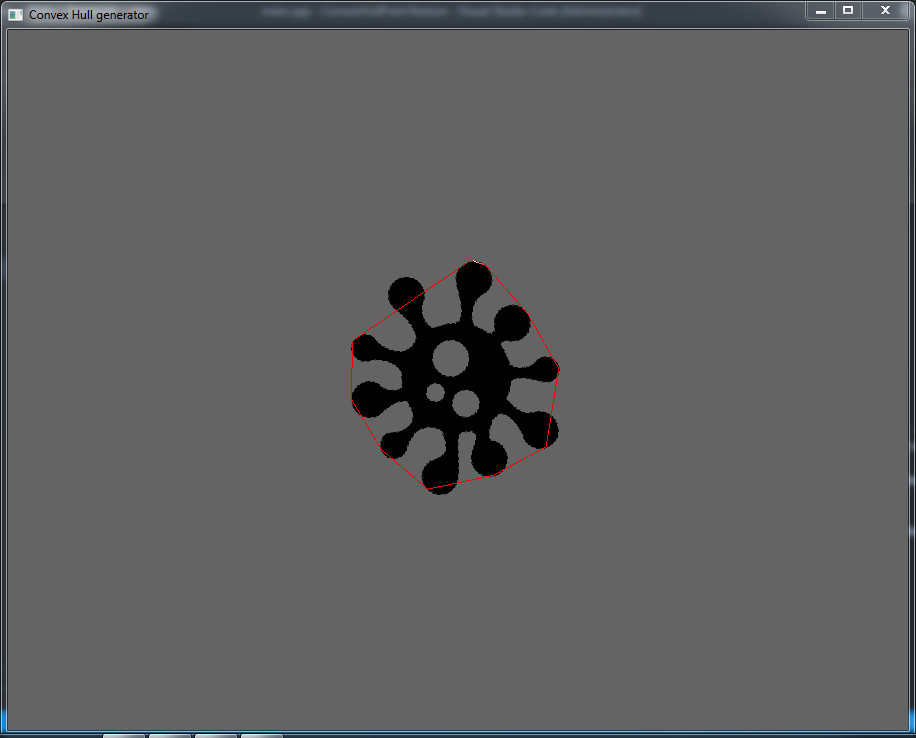

# Generate Convex Hull that bounds a TRANSPARENT BACKGROUND image using Monotone chain algorithm

Generate convexhull with given maximum vertices, you can change it in main file.

This algorithm run O(m*n) time complexities with m and n is image size.

This will only work only with transparent background images as each pixel is considered as a point in space.

You only need to run this one time, and then apply the sprite's transform to bound the sprite perfectly.

# Example

You can change the maxPolygonVertices to higher value, but I dont suggest doing that.

# USEFUL

It gives you better collision detection and collision solver.

# Solution for non-transparent background images

You have to add some pixels with same color represent the convex hull vertices of the image. and rewrite the checkColor function to match your pixels colors.
